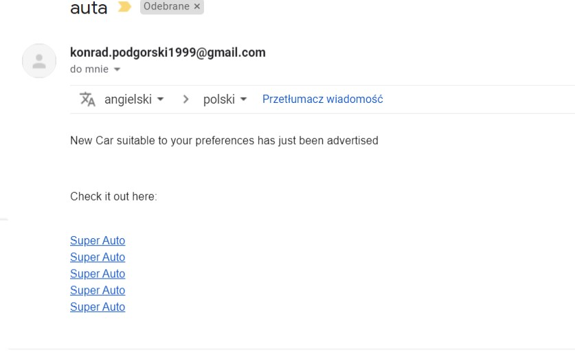

# MyCar
MyCar app based on microservices infrastructure.

App is composed of two main functionalities:

a)Car market service (backend)

which was my first idea and it was developed to some extend like addind offers to market and storing into database
or dinamically searching for offers(by the use od criteria queries)

b)User preferences notifier

This is the most useful part since service allows user to type his car preference and look it up on the internet.

To search for particular offer i made use of Allegro API.

Service look up for offers constantly and send email whenever appropriate offer shows up. 

Appropriate means the offer which meet particular user criteria.

The Output of app looks like this: 

Links are generated on backend and sended via email.

To get notifications all user have to do is to send preferences via JSON to appropriate endpoint.
There is a plan to make frontend which will consume MyCar api and make frontend side of this app, since now it 
is used only for personal purposes.
